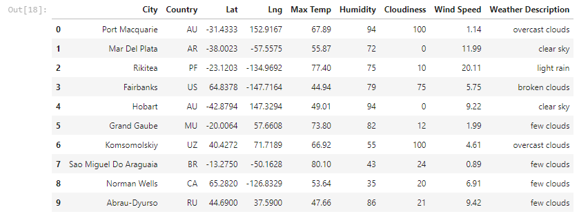
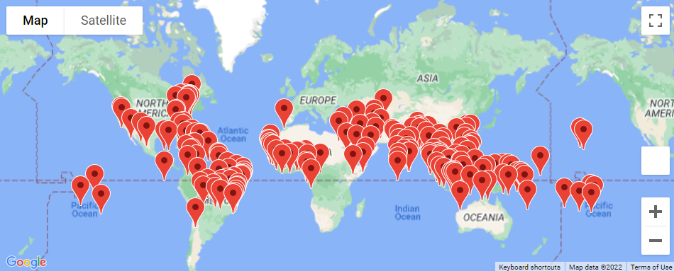
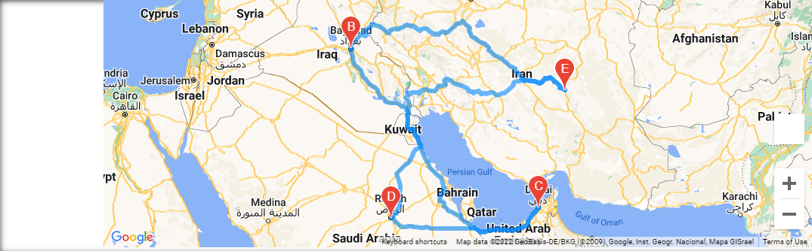
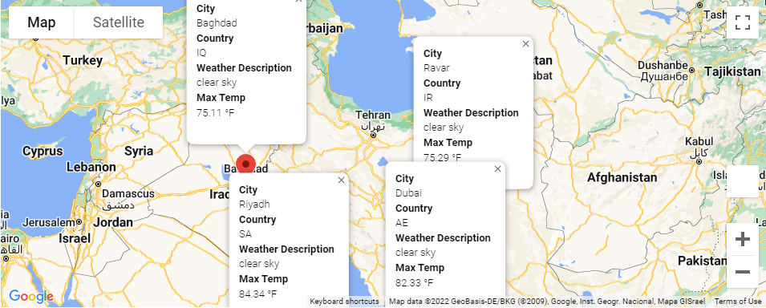

# World_Weather_Analysis
## Overview
The purpose of this analysis was to build an application that customers could use to filter their travel destinations by the current weather in that location. This was accomplished by using APIs to retrieve real-time weather data and location-based hotel information.

## Summary

To begin, a random list of 2,000 latitudes and longitudes were generated. I then imported CitiPy to find the nearest cities to the random locations, as well as their accompanying weather information, which resulted in an array that I then converted into a DataFrame.

Next, input boxes were added to that the customer could select their weather preferences. For the purposes of testing, I input a minimum temperature of 75* F and a maximum temperature of 85* F. This returned 196 results, which I then matched to 196 corresponding hotels. This is shown by the markers below.

I decided to narrow my results to four different destinations within the narrowed DataFrame: Ravar, Baghdad, Dubai and Riyadh. A travel route was then generated beginning in Ravar, traveling to Baghdad, then moving on to Dubai, detouring to Riyadh, then returning to Ravar.

Finally, I inserted code that would populate information for the City, Country, Max Temp and Current Weather if a customer were to click on the markers. Please see below.

## Results

Below the four resulting destinations are listed along with their hotel information, max temperature, and current weather conditions.

### Ravar

* Country: Iran
* Hotel: computertik
* Max Temp: 75.29
* Current Weather: Clear Sky

### Baghdad

* Country: Iraq
* Hotel: Baghdad Hotel
* Max Temp: 75.11
* Current Weather: Clear Sky

### Dubai

* Country: United Arab Emirates
* Hotel: Radisson Blu Hotel, Dubai Deira Creek
* Max Temp: 82.33
* Current Weather: Clear Sky
* 
### Riyadh

* Country: Saudi Arabia
* Hotel: InterContinental Riyadh, an IHG Hotel
* Max Temp: 84.34
* Current Weather: Clear Sky
